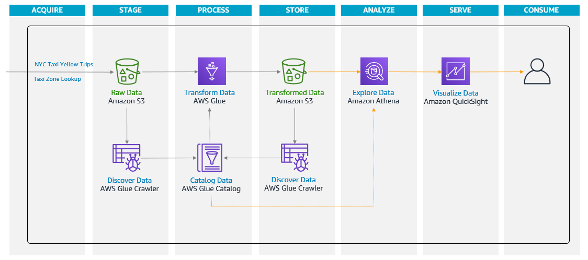

# AWS End-to-End Serverless Data Pipeline

This project demonstrates an end-to-end serverless data pipeline with data ingestion, data transformation, and data visualization using various AWS services.

## AWS Services Used

- **AWS S3**: Storage for raw and processed data.
- **AWS Glue**: Data catalog, crawlers, and data studio for ETL processes.
- **AWS Athena**: Querying data stored in S3 using SQL.
- **AWS QuickSight**: Data visualization and business intelligence.

## Architecture

## Steps

1. Store the dataset in AWS S3.
2. Create a Glue Crawler to auto-discover the schema of the data stored in S3.
3. Use Amazon Athena to explore the data and identify data quality issues.
4. Use Glue Data Studio to create a job that automatically performs transformations and saves the processed data in an optimized format to AWS S3.
5. Access the transformed data stored in Amazon S3 and visualize the data in Amazon QuickSight.

## Running the Queries

To run these queries, you need access to the AWS serverless data lake where the `raw_yellow_tripdata` and `raw_taxi_zone_lookup` tables are stored. You can execute these queries using a SQL client that supports AWS serverless databases.